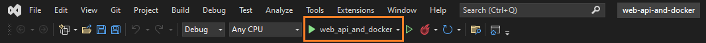
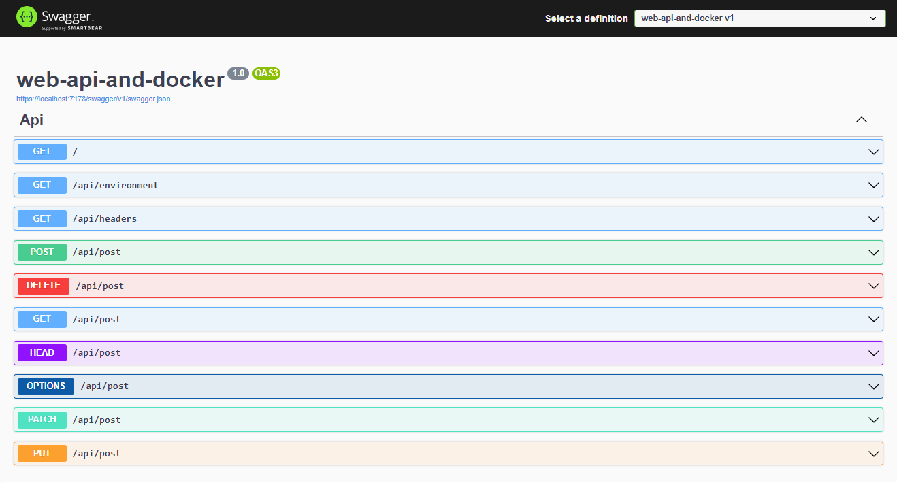
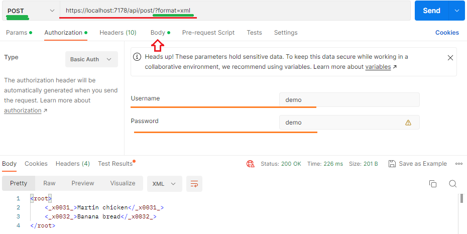
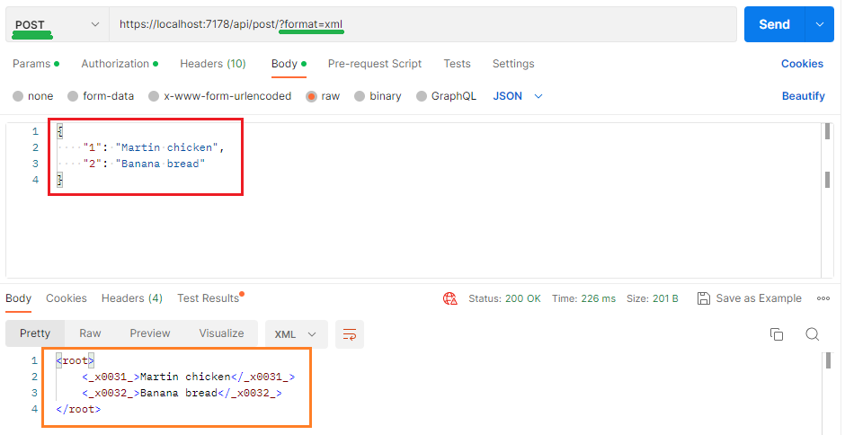

# web-api-and-docker
An ASP.NET Core Web API .NET 6 application.
 - Domain name and port: https://localhost:7178 
 - Routes: 
    - /
      - return "Hello world!"
    - /api/environment
      - returns all **environment variables** in 3 different formats – HTML, JSON and XML.
    - /api/headers
      - returns all <b>request headers</b> in 3 different formats – HTML, JSON and XML.
    - /api/post
      - returns <b>post body fields</b> in 3 different formats – HTML, JSON and XML.
 - Basic access authentication. Credentials – username “demo” with a password “demo”
## :exclamation::exclamation::exclamation: Download and install :exclamation::exclamation::exclamation:

.NET 6.0  
https://dotnet.microsoft.com/en-us/download

### To run your program:

If you are new to .NET visit [microsoft.com](https://dotnet.microsoft.com/en-us/learn)

1. You need to clone or download project from GitHub [project page](https://github.com/kristaps-m/web-api-and-docker)

2. You need the .NET Framework and an IDE (integrated development environment) to work with the C# language. [Try this page to get started.](https://www.simplilearn.com/c-sharp-programming-for-beginners-article)

3. Open and run project with capable IDE of your choice. I used Visual Studio in example below.

  - Or go to in project directory "\web-api-and-docker" open powershell or terminal and run project using 'dotnet watch run' command.
  - If web browser does not open automatically, go to 'https://localhost:7178/swagger/index.html'

4. Visual Studio should open browser window automaticaly with Swagger project page or go 
[https://localhost:7178/swagger/index.html](https://localhost:7178/swagger/index.html)

5. To use web-api-and-docker API, click on 'GET /api/environment' --> 'Try it out' --> 'Execute'. And you will see all environment variables (html is default format).

  - Now you can use all endpoints.
    - remeber /api/post Basic access authentication.
  - For more information about how to use Swagger visit:
    - [https://learn.microsoft.com](https://learn.microsoft.com/en-us/aspnet/core/tutorials/web-api-help-pages-using-swagger?view=aspnetcore-6.0)
    - Or you can use Postman [https://www.postman.com/product/what-is-postman/](https://www.postman.com/product/what-is-postman/) to work with API.

6. To return environment variables in 3 different formats html, json and xml use URL query parameters:
  - JSON format = https://localhost:7178/api/environment/?format=json
  - XML format = https://localhost:7178/api/environment/?format=xml
  - HTML format = https://localhost:7178/api/environment
    - remeber html is default format. So even '../enviroment/?format=hello' will return html format.

7. Do the same with HTTP headers and route /api/headers

8. To use /api/post route and return post body fields. I suggest using Postman.
  - remeber to insert username and password.

9. Improvements in future:

- [ ] add fully functional docker.
- [ ] for testing purposes add other authorization methods.